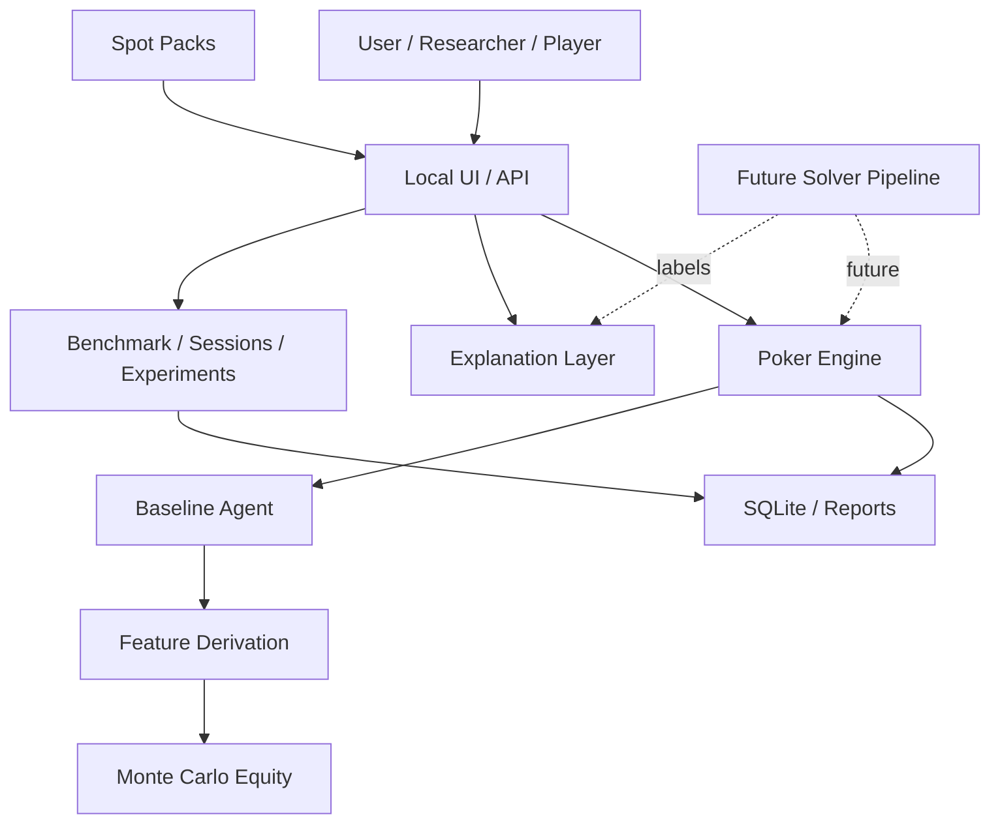

# Diagram 01 — System Context

```mermaid
flowchart TD
    User[User / Researcher / Player] --> UI[Local UI / API]
    UI --> Engine[Poker Engine]
    UI --> Coach[Explanation Layer]
    Engine --> Persistence[SQLite / Reports]
    Engine --> Baseline[Baseline Agent]
    Baseline --> Features[Feature Derivation]
    Features --> Equity[Monte Carlo Equity]
    UI --> Benchmark[Benchmark / Sessions / Experiments]
    Benchmark --> Persistence
    SpotPacks[Spot Packs] --> UI
    FutureSolver[Future Solver Pipeline] -. future .-> Engine
    FutureSolver -. labels .-> Coach
```
