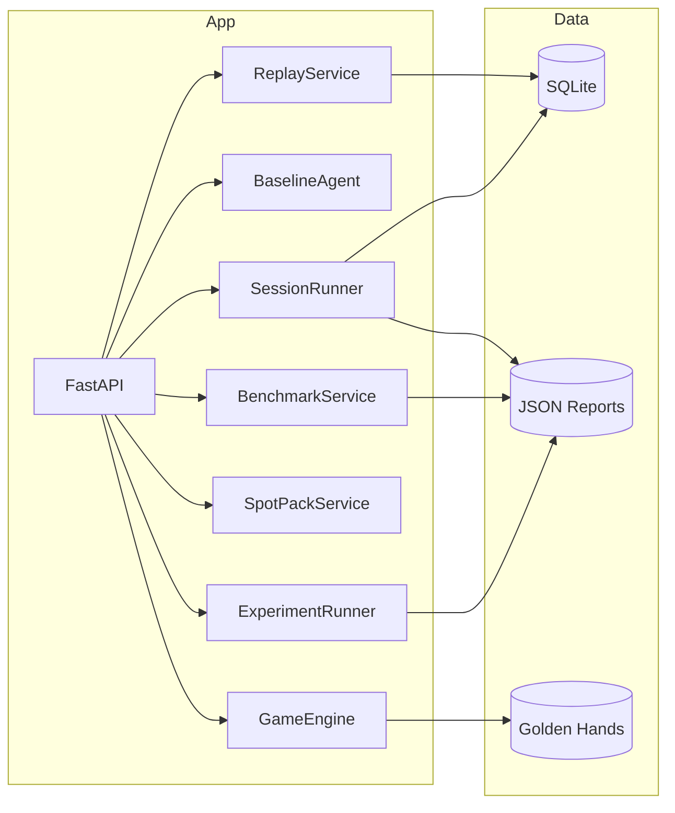

# Diagram 02 — Container View

```mermaid
flowchart LR
    subgraph App
      API[FastAPI]
      Engine[GameEngine]
      Agent[BaselineAgent]
      Replay[ReplayService]
      Sessions[SessionRunner]
      Spots[SpotPackService]
      Bench[BenchmarkService]
      Experiments[ExperimentRunner]
    end

    subgraph Data
      DB[(SQLite)]
      Reports[(JSON Reports)]
      Golden[(Golden Hands)]
    end

    API --> Engine
    API --> Agent
    API --> Replay
    API --> Sessions
    API --> Spots
    API --> Bench
    API --> Experiments
    Replay --> DB
    Sessions --> DB
    Sessions --> Reports
    Bench --> Reports
    Experiments --> Reports
    Engine --> Golden
```
