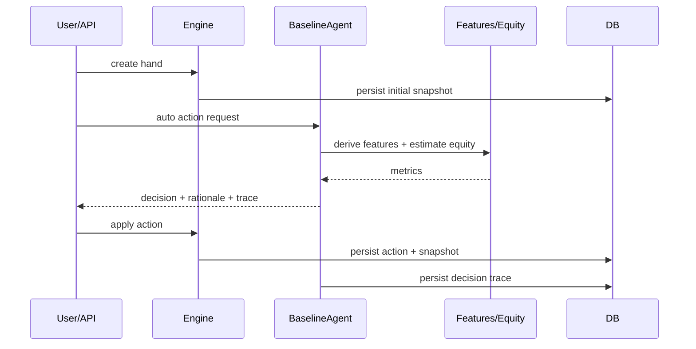

# Diagram 03 — Runtime Decision Sequence

```mermaid
sequenceDiagram
    participant U as User/API
    participant E as Engine
    participant A as BaselineAgent
    participant F as Features/Equity
    participant D as DB

    U->>E: create hand
    E->>D: persist initial snapshot
    U->>A: auto action request
    A->>F: derive features + estimate equity
    F-->>A: metrics
    A-->>U: decision + rationale + trace
    U->>E: apply action
    E->>D: persist action + snapshot
    A->>D: persist decision trace
```
