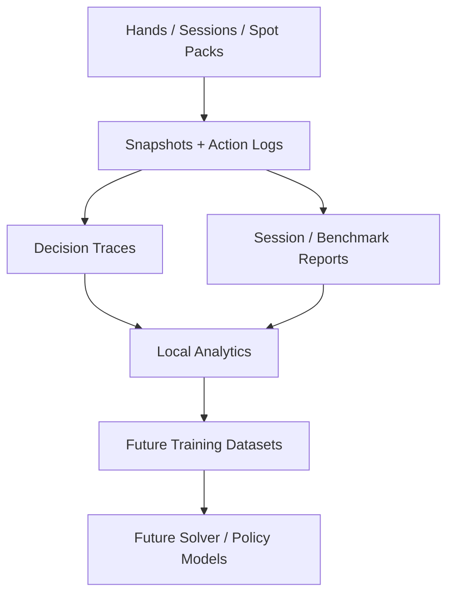

# Diagram 04 — Training and Evaluation Pipeline

```mermaid
flowchart TD
    HandRuns[Hands / Sessions / Spot Packs] --> Snapshots[Snapshots + Action Logs]
    Snapshots --> Traces[Decision Traces]
    Snapshots --> Reports[Session / Benchmark Reports]
    Traces --> Analysis[Local Analytics]
    Reports --> Analysis
    Analysis --> FutureDatasets[Future Training Datasets]
    FutureDatasets --> FutureModels[Future Solver / Policy Models]
```
