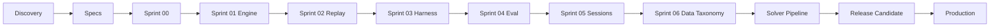

# Diagram 05 — Roadmap Flow

```mermaid
flowchart LR
    D[Discovery] --> S[Specs]
    S --> B0[Sprint 00]
    B0 --> B1[Sprint 01 Engine]
    B1 --> B2[Sprint 02 Replay]
    B2 --> B3[Sprint 03 Harness]
    B3 --> B4[Sprint 04 Eval]
    B4 --> B5[Sprint 05 Sessions]
    B5 --> B6[Sprint 06 Data Taxonomy]
    B6 --> B7[Solver Pipeline]
    B7 --> RC[Release Candidate]
    RC --> PROD[Production]
```
