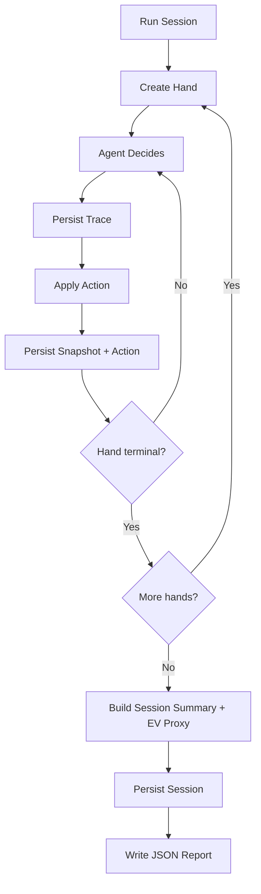

# Diagram 06 — Session Eval Flow

```mermaid
flowchart TD
    Start[Run Session] --> NewHand[Create Hand]
    NewHand --> Decide[Agent Decides]
    Decide --> Trace[Persist Trace]
    Trace --> Apply[Apply Action]
    Apply --> Persist[Persist Snapshot + Action]
    Persist --> Done{Hand terminal?}
    Done -- No --> Decide
    Done -- Yes --> Next{More hands?}
    Next -- Yes --> NewHand
    Next -- No --> Summary[Build Session Summary + EV Proxy]
    Summary --> Store[Persist Session]
    Store --> Report[Write JSON Report]
```
