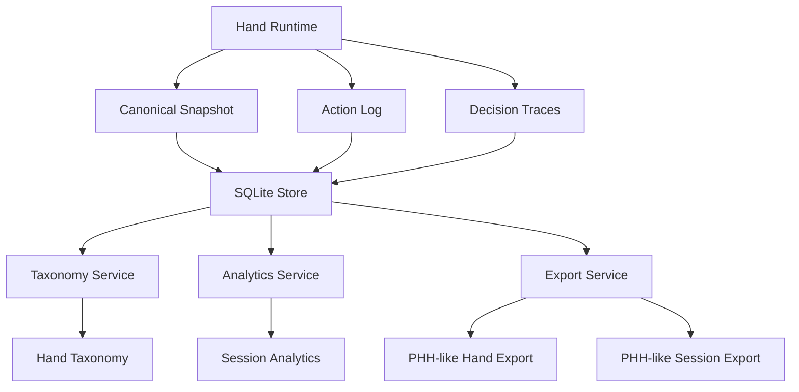

# PHH-like Export and Session Analytics

```mermaid
flowchart TD
    A[Hand Runtime] --> B[Canonical Snapshot]
    A --> C[Action Log]
    A --> D[Decision Traces]
    B --> E[SQLite Store]
    C --> E
    D --> E
    E --> F[Taxonomy Service]
    E --> G[Analytics Service]
    E --> H[Export Service]
    F --> I[Hand Taxonomy]
    G --> J[Session Analytics]
    H --> K[PHH-like Hand Export]
    H --> L[PHH-like Session Export]
```
