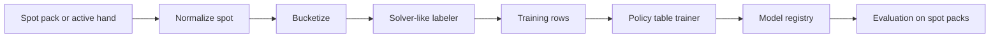

```mermaid
flowchart LR
  A[Spot pack or active hand] --> B[Normalize spot]
  B --> C[Bucketize]
  C --> D[Solver-like labeler]
  D --> E[Training rows]
  E --> F[Policy table trainer]
  F --> G[Model registry]
  G --> H[Evaluation on spot packs]
```
