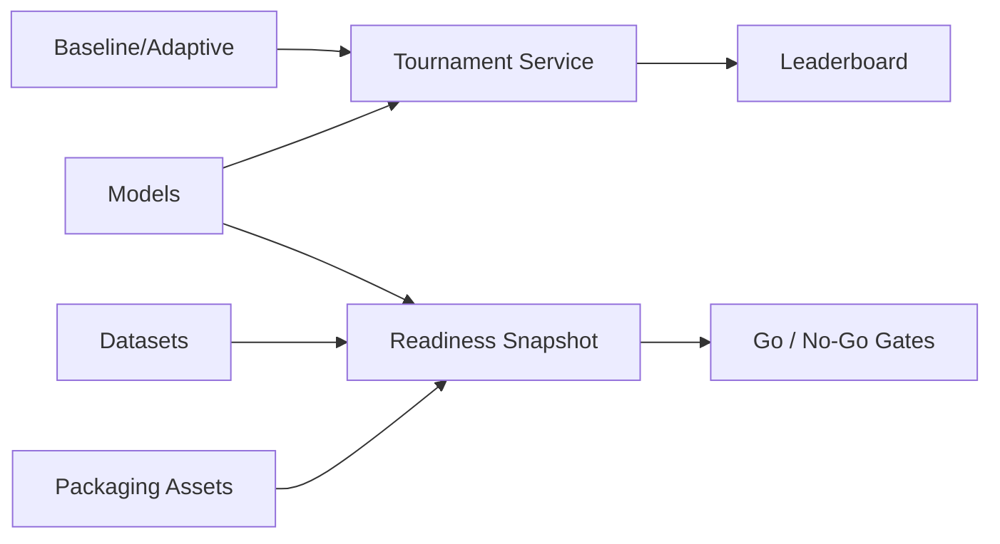

```mermaid
flowchart LR
    M[Models] --> T[Tournament Service]
    A[Baseline/Adaptive] --> T
    T --> L[Leaderboard]
    D[Datasets] --> Q[Readiness Snapshot]
    M --> Q
    P[Packaging Assets] --> Q
    Q --> G[Go / No-Go Gates]
```
